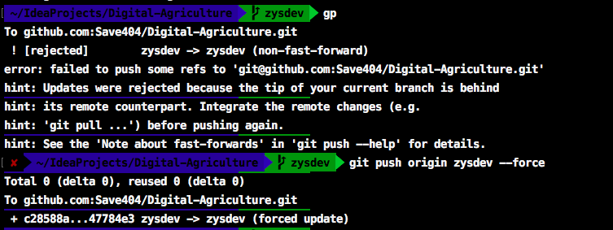

## 介绍       

　　Git是做项目的版本管理，你也可以称它们为版本管理工具。假如现在你有一个文件夹，里面可以是项目，也可以是你的个人笔记(如我这个博客)，或者是你的简历、毕业设计等等，都可以使用git来管理。

<!--more-->

　　目前常用的版本控制器有Git和SVN，即使这两个你没有全用过，至少也会听过，我这里以Git为例，个人比较喜欢Git，你也可以看看这篇文章：[为什么Git比SVN好](http://www.worldhello.net/2012/04/12/why-git-is-better-than-svn.html)。我使用的是Mac，Mac上没自带Git环境，但是作为iOS开发者，我安装Xcode的时候，Xcode里是有自带Git的，所以我不需要考虑怎么去安装Git了。          

## 安装Git

**在Mac OS X上安装Git**      

提供两种方法参考：      

> 1、通过homebrew安装Git，具体方法请参考[homebrew的文档](http://brew.sh/)      
> 2、直接从AppStore安装Xcode，Xcode集成了Git，不过默认没有安装，你需要运行Xcode。     

**在Windows上安装Git**      

> 从[https://git-for-windows.github.io](https://git-for-windows.github.io) 下载，然后按默认选项安装即可，安装完成后，在开始菜单里找到“Git”->“Git Bash”，蹦出一个类似命令行窗口的东西，就说明Git安装成功！


## 配置Git      

安装完成后，还需要最后一步设置，在命令行输入：

>* $ git config --global user.name "Your Name"
>* $ git config --global user.email "email@example.com"

"Your Name"： 是每次提交时所显示的用户名，因为Git是分布式版本控制系统，当我们push到远端时，就需要区分每个提交记录具体是谁提交的，这个"Your Name"就是最好的区分。          

"email@example.com"： 是你远端仓库的email       

--global：用了这个参数，表示你这台机器上所有的Git仓库都会使用这个配置，当然我们也可以对某个仓库指定不同的用户名和Email地址。         


## 开始使用

### 建立仓库

你在目标文件夹下使命令：    

>* git init  （创建.git文件）      

就会创建一个 `.git` 隐藏文件，相当于已经建立了一个本地仓库。

**添加到暂存区：**      

>* git add .   （全部添加到暂存区）    
>* git commit -m ' first commit'  （提交暂存区的记录到本地仓库）     

### 分支  

git branc 查看时如出现

>*  (HEAD detached at analytics_v2)   
>*  dev
>*  master

代表现在已经进入一个临时的HEAD，可以使用 `git checkout -b temp` 创建一个 temp branch，这样临时HEAD上修改的东西就不会被丢掉了。
然后切换到 dev 分支上，在使用 git branch merge temp，就可以把 temp 分支上的代码合并到 dev 上了。

### 查看历史提交  
```bash
git log --oneline --graph --decorate
```

## 提示技巧

### 历史提交"续命"

在之前修改了一个文件，但是没有commit，现在我想要commit，日期为那天的日期  
```bash
#git commit --date="月 日 时间 年 +0800" -am "提交"
git commit --date="Dec 10 9:05:20 2017 +0800" -am "提交"
```

### 撤销push到远程仓库的commit
先在本地回退到相应的版本：
```bash
git reset --hard <版本号>
// 注意使用 --hard 参数会抛弃当前工作区的修改
// 使用 --soft 参数的话会回退到之前的版本，但是保留当前工作区的修改，可以重新提交
```
如果此时使用命令：
```bash
git push origin <分支名>
```
会提示本地的版本落后于远端的版本  


为了覆盖掉远端的版本信息，使远端的仓库也回退到相应的版本，需要加上参数--force
```bash
git push origin <分支名> --force
```

### fork的仓库与原仓库同步
```bash
# 将原仓库远程地址添加到本地，并命名为upstream分支
git remote add upstream git@github.com:....git
# 获取原仓库内容
git fetch upstream
# 合并到本地master分支
git merge upstream/master
# 推送到自己fork过来的远程仓库
git push
```

### 修改已经push到远程仓库的上一个commit message
```sh
# 修改上一个commit message
git commit --amend

# 强制推送到远程仓库
git push -f
```

### [部署]本地创建gh-pages并推送到远程
```sh
# 先在项目目录下构建
npm run build # yarn build

# 切进部署的静态文件目录里
cd .../dist

# 创建gh-pages并推送到远程
git add --all
git commit -m 'deploy'
git push -f git@github.com:ZYSzys/<repoName>.git master:gh-pages
```

## 参考
[git Documentation](https://git-scm.com/book/zh/v2)
   

