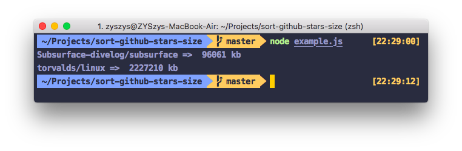
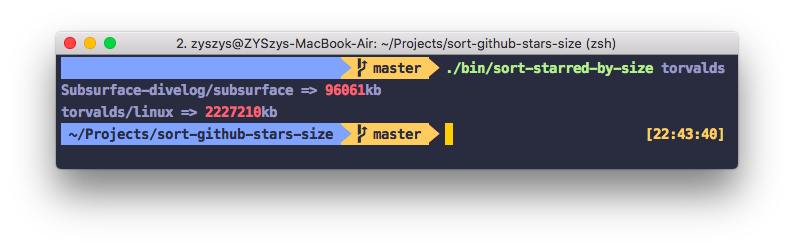

## 起因

&emsp;&emsp;对于代码初学者来说，`GitHub` 是一个很好的网站。在这里，他们可以学习如何更好地写代码并提高代码能力，学习编码规范，各种框架......  
&emsp;&emsp;然而对于像我一下的初学者来讲，有时候不知道要如何从 `GitHub` 的优秀项目中学习、要从何开始阅读源码。  
&emsp;&emsp;所以我想到了一个方法: **将自己  `star` 过的所有优秀项目按仓库大小(** **代码量** **)进行排序**，从代码量小的项目开始研究，逐步提升代码能力。

<!--more-->

## 准备

想好了项目的目的，列出以下几种需要用到的技术:  

* JavaScript  
* NodeJs  
* [GitHub API](https://developer.github.com/v3/)

并找到了一个极小的 `GitHub API` 封装工具: [gh.js](https://github.com/IonicaBizau/gh.js)。

## 开始

### 安装项目依赖包

```sh
# 初始化项目
npm init 

npm install gh.js # 封装过的 GitHub API
npm install chalk # 美化终端命令行工具的字体颜色
npm install ora   # 优雅的终端加载条
```

### 创建项目入口 `index.js`

```js
const GitHub = require('gh.js')

/**
 * sortByStarredSize
 * Sort your personal starred repos by size.
 *
 * @name sortByStarredSize
 * @function
 * @param {String} username The GitHub username.
 * @param {String} token An optional access token.
 * @param {Function} callback The callback function.
 * @return {gh.js} The `gh.js` instance.
 */
function sortByStarredSize (username, token, callback) {
  if (typeof token === 'function') {
    callback = token
    token = undefined
  }

  const gh = new GitHub({ token: token })
  gh.get(`users/${username}/starred`, { all: true }, (err, repos) => {
    if (err) { return callback(err) }
    repos.sort(function (a, b) {
      return a.size > b.size ? 1 : -1
    })
    callback(null, repos)
  })

  return gh
}

module.exports = sortByStarredSize
```

### 创建测试样例 `example.js`

```js
const sortGhStarredSize = require('.')

// 以大神 Linus Torvalds 的GitHub用户名torvalds为例
const username = 'torvalds'

sortGhStarredSize(username, (err, repos) => {
  console.log(err || repos.map(function(c) {
    return `${c.full_name} => ${c.size} kb`
  }).join('\n'))
})
```

运行结果如下:




😈 哈哈，成功得到了我们想要的结果。

### 封装成命令行工具

创建 `bin/sort-starred-by-size`:

```js

const ora = require('ora')
const chalk = require('chalk')
const spinner = ora('Sorting...')
spinner.start()

if (!process.argv[2]) {
  spinner.stop()
  console.log(chalk.green('sort-starred-by-size ~ ' + require('../package').version))
  console.log(chalk.gray('Sort your personal starred repos by size in command line.'))
  console.log(chalk.cyan('  $ ') + 'sort-starred-by-size torvalds')
  console.log(chalk.cyan('  $ ') + 'sort-starred-by-size ZYSzys')

  return
} else {
  const username = process.argv.slice(2).join('')
  const sort = require('..')
  sort(username, (err, repos) => {
    spinner.stop()
    console.log(err || repos.map(function(c) {
      return `${c.full_name} => ` + chalk.red(`${c.size}`) + `kb`
    }).join("\n"))
  })
}
```

再测试一下:



### 发布到 npm

在 `package.json` 中添加 `bin` 字段:

```js
  "bin": {
    "sort-starred-by-size": "./bin/sort-starred-by-size"
  },
```

发布到 [npmjs.com](npmjs.com):

```
npm publish
```

以后通过 `npm install -g sort-github-stars-size` 安装本模块后，就能通过 `sort-starred-by-size username` 来对已 star 的 GitHub仓库进行按代码量从小到大排序了。

## 项目完整地址: [sort-github-stars-size](https://github.com/ZYSzys/sort-github-stars-size)  
欢迎 **PR** 或 **issue** 来提供建议(目前性能亟待优化)。